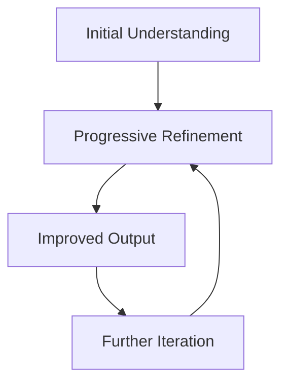
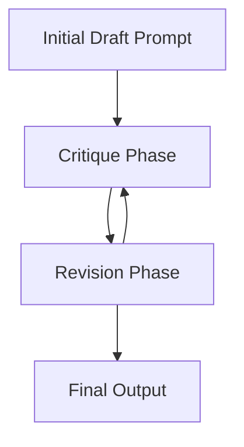

# 🔄 Chain of Draft (CoD) Prompting

> 🎯 **TL;DR**: Chain of Draft (CoD) is an advanced prompting technique designed to improve the quality and consistency of responses from large language models (LLMs). It moves beyond simple prompt engineering by incorporating a structured, iterative process that mimics a drafting and revision workflow. This method aims to address limitations of standard prompting, especially for complex or nuanced tasks.

Here's a breakdown of CoD prompting, including rules, best practices, and suggestions for effective implementation:

## 📚 Table of Contents

- [Core Concept](#-core-concept-iterative-refinement)
- [Key Components](#-key-components)
- [Rules & Best Practices](#-rules-best-practices-and-suggestions)
- [Implementation Examples](#-implementation-example)
- [Benefits & Limitations](#-benefits-and-limitations)
- [Advanced Topics](#-advanced-topics)
- [Resources](#-resources)

## 🔄 Core Concept: Iterative Refinement



CoD is rooted in the idea that complex outputs are best achieved through iterative refinement. Instead of expecting a perfect response from a single prompt, CoD prompts guide the LLM through a series of drafts, each building upon and improving the previous one. This process allows the model to progressively refine its understanding of the task and generate more coherent and high-quality outputs.

**Core Principle: Iterative Refinement**

At its heart, CoD is based on the principle that complex outputs are best developed through iterative improvement. Instead of aiming for perfection in a single attempt, CoD guides the LLM through multiple drafts, each building upon and improving the last. This iterative cycle allows the model to progressively deepen its understanding of the task and produce more refined and superior outputs.

## 🏗️ Key Components of CoD Prompting



1. **Initial Draft Prompt** 📝
   This prompt sets the stage and requests the LLM to generate an initial, often basic, draft of the desired output. It focuses on broad strokes rather than fine details.

2. **Critique and Revision Prompts** 🔍
   These prompts are the heart of CoD. They follow the initial draft and instruct the LLM to critique its own previous draft and then revise it based on the critique. This critique-revision cycle can be repeated multiple times, each iteration focusing on different aspects of improvement.

3. **Specific Instructions** 📋
   Within each prompt, clear and specific instructions are crucial. These instructions guide the LLM on what to focus on in each draft and revision stage. For example, prompts might instruct the model to improve clarity, add detail, refine arguments, or correct factual errors.

## 📋 Rules, Best Practices, and Suggestions for CoD Prompting

### 🎯 I. Rules

- **Rule 1: Start with a Clear Initial Draft Prompt.**
  The initial prompt should clearly define the task and desired output format. Even though it's just a first draft, clarity at this stage sets the foundation for subsequent refinements.

- **Rule 2: Implement Iterative Critique and Revision Cycles.**
  CoD *must* involve critique and revision. A single draft is not CoD. The power comes from the iterative process of self-correction.

- **Rule 3: Provide Specific and Actionable Instructions in Critique and Revision Prompts.**
  General prompts like "improve the draft" are less effective. Prompts should guide the LLM to focus on specific areas for improvement, such as "critique for clarity and revise to improve it" or "critique the factual accuracy and revise with corrections".

- **Rule 4: Maintain Context Across Iterations.**
  Each prompt should reference the previous draft and build upon it. The LLM needs to understand that it's working on the same task and refining the same output across prompts.

### ✨ II. Best Practices

- **Best Practice 1: Focus Each Iteration on Specific Aspects of Quality.**
  Don't try to improve everything at once. Dedicate each critique-revision cycle to a specific dimension of quality like:

  | Aspect | Focus Areas |
  |--------|-------------|
  | **Clarity and Coherence** | Improving sentence structure, logical flow, and overall understandability |
  | **Factual Accuracy** | Verifying and correcting factual claims |
  | **Completeness and Detail** | Adding more relevant information and elaborating on key points |
  | **Relevance and Focus** | Ensuring the output directly addresses the prompt and stays on topic |
  | **Tone and Style** | Refining the writing style to match the desired audience and purpose |

- **Best Practice 2: Use Role-Playing in Prompts.**
  Instruct the LLM to adopt specific roles during critique and revision. For example:
  - *"Act as a professional editor and critique the previous draft for grammar, style, and clarity."*
  - *"Assume the role of a fact-checker and identify any potential inaccuracies in the draft."*
  - *"Imagine you are the target audience and critique the draft for understandability and relevance."*

- **Best Practice 3: Vary the Critique Perspective.**
  To get a well-rounded critique, consider using different perspectives in each iteration. For instance, one critique could focus on factual accuracy, the next on logical flow, and another on stylistic refinement.

- **Best Practice 4: Control the Number of Iterations.**
  While iterative refinement is powerful, excessive iterations can lead to diminishing returns or even redundancy. Determine an appropriate number of cycles based on the complexity of the task and desired level of quality. Start with a few iterations (e.g., 2-4) and adjust as needed.

- **Best Practice 5: Experiment with Different Prompt Structures.**
  CoD is flexible. Experiment with different ways to structure your prompts. You can use numbered lists, bullet points, or paragraph-based instructions. Find what works best for your specific task.

### 💡 III. Suggestions for Enhanced CoD Prompting

- **Suggestion 1: Incorporate External Knowledge (If Necessary).**
  For tasks requiring specific knowledge, you can guide the LLM to incorporate external information during the revision process. This could involve suggesting search queries or providing relevant documents.

- **Suggestion 2: Use Examples in Prompts.**
  Providing examples of good and bad drafts or critiques can help the LLM better understand what is expected in each stage.

- **Suggestion 3: Monitor and Evaluate Each Draft.**
  Briefly review each draft generated by the LLM to ensure the critique and revision prompts are effective and the output is moving in the right direction. This allows for adjustments to prompts in subsequent iterations if needed.

- **Suggestion 4: Combine CoD with Other Prompting Techniques.**
  CoD can be effectively combined with other methods like "Chain of Thought" for complex reasoning tasks or "Few-Shot Learning" by providing examples in the initial prompt.

- **Suggestion 5: Apply CoD to Various Output Types.**
  CoD is not limited to text generation. It can be applied to code generation, creative content, and even structured data outputs.

## 💻 Example of a CoD Prompting Sequence

### Writing a Short Essay

```sequence
Initial Draft->Critique 1: Clarity Review
Critique 1->Revision 1: Improve Structure
Revision 1->Critique 2: Fact Check
Critique 2->Final Draft: Polish Content
```

1. **Initial Draft Prompt:**
   *"Write a short draft essay (about 300 words) on the impact of social media on modern society."*

2. **Critique Prompt 1:**
   *"Critique the draft essay above for clarity and coherence. Identify any sentences or paragraphs that are unclear, disorganized, or lack logical flow."*

3. **Revision Prompt 1:**
   *"Revise the essay based on the critique above to improve clarity and coherence. Focus on sentence structure, paragraph organization, and logical transitions."*

4. **Critique Prompt 2:**
   *"Now, act as a fact-checker. Critique the revised essay for factual accuracy. Identify any claims that might be inaccurate or lack evidence."*

5. **Revision Prompt 2:**
   *"Revise the essay again, addressing the factual accuracy critiques. Correct any inaccuracies and add brief supporting evidence where necessary."*

This sequence demonstrates how CoD systematically refines an initial draft through targeted critique and revision prompts, leading to a more polished and robust final output.

## 📊 Benefits and Limitations

### Benefits ✅

| Benefit | Description |
|---------|-------------|
| Improved Output Quality | CoD generally leads to more refined, coherent, and accurate outputs compared to single-prompt approaches, especially for complex tasks |
| Enhanced Consistency | The structured process of CoD can make LLM responses more predictable and consistent in quality |
| Greater Control | CoD gives users more control over the generation process, allowing them to guide the LLM towards specific quality dimensions |
| Better Handling of Complexity | CoD is particularly effective for tasks that require nuanced understanding, detailed outputs, or multi-faceted reasoning |
| Efficiency in Reasoning | CoD can achieve similar or better accuracy than Chain-of-Thought (CoT) prompting while using significantly fewer tokens |

### Limitations ⚠️

| Limitation | Impact |
|------------|--------|
| Increased Prompt Complexity | CoD prompts are more complex to design than simple prompts, requiring careful planning of critique and revision cycles |
| Higher Token Usage | The iterative nature of CoD can lead to higher token consumption compared to single-prompt generation |
| Not Always Necessary | For very simple or straightforward tasks, the overhead of CoD might not be justified |
| Model Dependency | CoD may require larger models for optimal performance and might be less effective in zero-shot scenarios |

## 🎓 Advanced Topics

### Model Considerations 🤖

- **Model Size Requirements**
  - Larger models preferred for better performance
  - Enhanced context handling capabilities
  - Improved self-critique abilities
  - Better reasoning and refinement skills

- **Performance Optimization**
  - Token efficiency strategies
  - Context window management
  - Quality vs. speed trade-offs
  - Resource utilization

### Implementation Strategy 📈

1. **Planning Phase**
   - Define clear objectives
   - Set quality criteria
   - Design iteration strategy
   - Allocate resources

2. **Execution Phase**
   - Monitor progress
   - Adjust prompts
   - Track improvements
   - Validate outputs

3. **Refinement Phase**
   - Optimize workflows
   - Document patterns
   - Share learnings
   - Scale successful approaches

## 📚 Resources

### Learning Materials 📖

- [Learn Prompting](https://learnprompting.org/docs/advanced/thought_generation/chain-of-draft)
- [arXiv Paper](https://arxiv.org/html/2502.18600v1)
- [DEV Community Article](https://dev.to/foxgem/chain-of-draft-thinking-faster-by-writing-less-54j6)

### Research and Development

- Ongoing studies in prompt engineering
- New applications and use cases
- Performance benchmarking
- Best practices evolution

---

> 🌟 **Pro Tip**: Chain of Draft prompting is a powerful technique for those looking to maximize the output quality from LLMs, especially for complex and nuanced tasks. By emulating a human-like drafting process, it provides a structured and controlled method for generating high-caliber LLM outputs. While it demands more upfront effort in prompt design, the enhanced output quality and consistency often justify this investment.

*Last updated: 13-MAR-2025*
